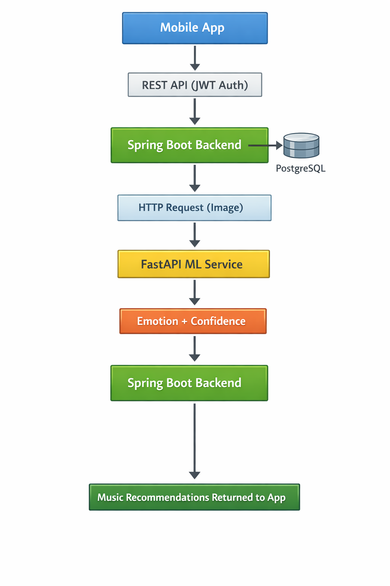
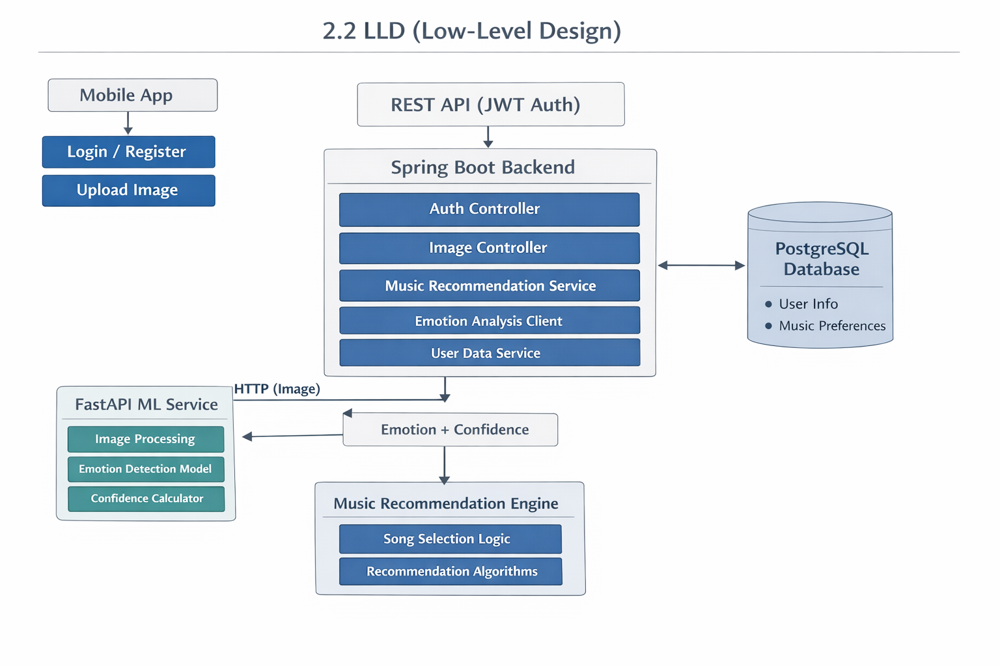

# Emotion-Based Music Recommendation Platform

## Repositories

- **Frontend:** https://github.com/Optimas-CSE23L197/myMusic_Frontend
- **Backend:** https://github.com/Optimas-CSE23L197/myMusic_Backend
- **ML Server:** https://github.com/soumya7003/College_Project_Ml

## 1. Abstract

### What

A **real-time emotion-aware music recommendation system** that detects a user’s facial expression and suggests music based on mood.

### Why

Existing music platforms rely on static preferences and cannot adapt to a user’s **real-time emotional state**.

### Outcome

A secure, microservice-based platform combining a **mobile app**, **backend services**, and an **ML model** to deliver accurate emotion detection and personalized music recommendations in real time.

---

## 2. System Architecture

This platform follows a **microservice-based architecture** with clear separation between the **Frontend (Mobile App)**, **Backend Services**, and **ML Emotion Detection Service**.

### Architecture Flow (End-to-End)

1. User opens the mobile app and captures a facial image.
2. Image is sent to the Backend via REST API.
3. Backend forwards the image to the ML microservice.
4. ML service returns the detected emotion.
5. Backend maps emotion → music category/playlist.
6. Backend returns recommended songs to the mobile app.

---

### 2.1 HLD (High-Level Design)

#### Components

**1) Mobile App (React Native / Expo)**

- Captures user facial image using camera module
- Displays detected emotion + recommended songs
- Handles authentication (JWT storage)
- Sends API requests to backend

**2) Backend (Spring Boot, Java 17)**

- Central orchestrator for the platform
- Manages authentication + user profiles
- Handles image upload & forwarding to ML service
- Generates final recommendation list
- Stores user history and feedback

**3) ML Emotion Detection Service (FastAPI, CNN)**

- Receives facial image input
- Preprocesses image (resize, normalize, etc.)
- Predicts emotion class using CNN model
- Returns emotion label + confidence score

**4) Database (PostgreSQL)**

- Stores users, emotions, recommendation history, song metadata, and feedback

**5) Media Storage (Cloudinary)**

- Stores uploaded images (optional, depending on requirement)
- Returns secure URLs for retrieval (if needed)

---

#### HLD Diagram (Logical View)



#### LLD Diagram (Logical View)



#### Backend Modules (Spring Boot)

**1) Auth Module**

- User registration/login
- JWT generation and validation
- Role-based access control (optional)

**2) Emotion Processing Module**

- Accepts uploaded image
- Calls ML service endpoint
- Parses emotion result and confidence

**3) Recommendation Module**

- Maps emotion → music category
- Fetches songs based on mapping rules
- Personalization support (future scope)

**4) History & Feedback Module**

- Saves recommendation results
- Stores user likes/dislikes (optional)
- Enables future personalized learning

---

#### ML Service LLD (FastAPI)

**1) API Layer**

- Endpoint to accept image input
- Returns emotion prediction response

**2) Preprocessing Layer**

- Face detection (optional)
- Resize to model input shape
- Normalize pixel values

**3) Model Inference Layer**

- CNN-based prediction
- Outputs emotion class probabilities

**4) Post-processing Layer**

- Picks highest probability emotion
- Adds confidence score
- Returns formatted JSON response

---

#### Recommendation Logic (LLD)

Example mapping (configurable):

| Emotion  | Recommendation Type  |
| -------- | -------------------- |
| Happy    | Upbeat / Party / Pop |
| Sad      | Calm / Acoustic      |
| Angry    | Rock / Metal         |
| Neutral  | Chill / Lo-fi        |
| Surprise | Trending / Energetic |

---

### 2.3 ER Diagram (Database Design)

#### Entities

##### `users`

- `id` (PK)
- `name`
- `email` (unique)
- `password_hash`
- `created_at`

##### `songs`

- `id` (PK)
- `title`
- `artist`
- `genre`
- `mood_tag` (happy/sad/neutral/etc.)
- `stream_url` (optional)
- `created_at`

##### `emotion_logs`

- `id` (PK)
- `user_id` (FK → users.id)
- `emotion`
- `confidence`
- `image_url` (optional)
- `detected_at`

##### `recommendations`

- `id` (PK)
- `user_id` (FK → users.id)
- `emotion_log_id` (FK → emotion_logs.id)
- `generated_at`

##### `recommendation_items`

- `id` (PK)
- `recommendation_id` (FK → recommendations.id)
- `song_id` (FK → songs.id)
- `rank` (1,2,3...)
- `score` (optional)

##### `feedback` (optional)

- `id` (PK)
- `user_id` (FK → users.id)
- `song_id` (FK → songs.id)
- `emotion`
- `liked` (boolean)
- `comment` (optional)
- `created_at`

---

#### Relationships (ER Summary)

- One `user` can have many `emotion_logs`
- One `emotion_log` can generate one `recommendations`
- One `recommendations` can contain many `recommendation_items`
- One `song` can appear in many `recommendation_items`
- One `user` can give many `feedback` entries

---

### 2.4 API Specifications

### Base URL

- `Dev: http://localhost:8080/api`

- `Prod: https://api.mymusic.com/api`

### Endpoints

- `POST /auth/login`
- `POST /auth/register`
- `POST /emotion/detect`
- `POST /recommendations`
- `GET /songs`
- `GET /songs/hip-hop`

#### Authentication

##### 1) Register User

**POST** `/auth/register`

**Request Body**

```json
{
  "name": "John Doe",
  "email": "john@gmail.com",
  "password": "StrongPassword123"
}
```

**Response**

```json
{
  "message": "User registered successfully"
}
```

##### 2) Login User

**POST** `/auth/login`

**Request Body**

```json
{
  "email": "john@gmail.com",
  "password": "StrongPassword123"
}
```

**Response**

```json
{
  "token": "JWT_TOKEN_HERE",
  "user": {
    "id": 1,
    "name": "John Doe",
    "email": "john@gmail.com"
  }
}
```

#### Emotion Detection + Recommendations

##### 3) Detect Emotion (via ML)

**POST** `/emotion/detect`

**Headers**

```txt
Authorization: Bearer <JWT_TOKEN>
Content-Type: multipart/form-data
```

**Form Data**

- `image` (file)

**Response**

```json
{
  "emotion": "happy",
  "confidence": 0.92
}
```

##### 4) Get Music Recommendations

**POST** `/recommendations`

**Headers**

```txt
Authorization: Bearer <JWT_TOKEN>
Content-Type: multipart/form-data
```

**Form Data**

- `image` (file)

**Response**

```json
{
  "emotion": "happy",
  "confidence": 0.92,
  "recommendations": [
    {
      "songId": 101,
      "title": "Blinding Lights",
      "artist": "The Weeknd",
      "genre": "Pop",
      "rank": 1
    },
    {
      "songId": 205,
      "title": "Levitating",
      "artist": "Dua Lipa",
      "genre": "Pop",
      "rank": 2
    }
  ]
}
```

#### History & Feedback (Optional)

##### 5) Get Recommendation History

**GET** `/history`

**Headers**

```txt
Authorization: Bearer <JWT_TOKEN>
```

**Response**

```json
[
  {
    "emotion": "sad",
    "detectedAt": "2026-01-15T10:30:00Z",
    "topSong": "Someone Like You"
  }
]
```

##### 6) Submit Feedback

**POST** `/feedback`

**Headers**

```txt
Authorization: Bearer <JWT_TOKEN>
Content-Type: application/json
```

**Request Body**

```json
{
  "songId": 101,
  "emotion": "happy",
  "liked": true,
  "comment": "Perfect mood match!"
}
```

**Response**

```json
{
  "message": "Feedback saved successfully"
}
```

## 3. Technologies & Tools

**Frontend**: `React Native`, `Expo`, `Redux` `Toolkit`, `Media`, `Expo Camera`, `Expo AV`

**Backend**: `Spring Boot`, `Java 17`,`REST APIs`

**Security**: `Spring Security`, `JWT Authentication`

**ML Service**: `Python`, `FastAPI`, `CNN (Emotion Detection Model)`

**Database**: `PostgreSQL`

**Cloud Storage**: `Cloudinary`

**Testing**: `JUnit`, `Mockito`, `Postman`

## 4. Testing & Automation

### Coverage Areas

- API validation
- Authentication and authorization
- Emotion detection accuracy
- Recommendation logic correctness

### Tools Used

- JUnit & Mockito (unit testing)
- Postman (API testing)

## 5. Future Enhancements

1. Real-time video-based emotion detection
2. Integration with music streaming platforms
3. Personalized learning from user history
4. Expanded emotion categories and improved model accuracy
